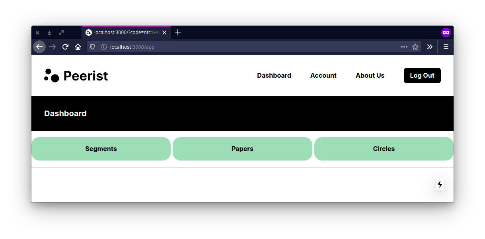
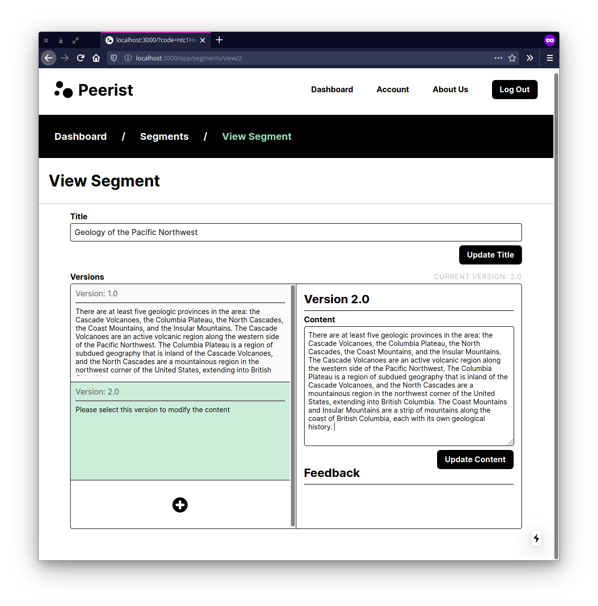
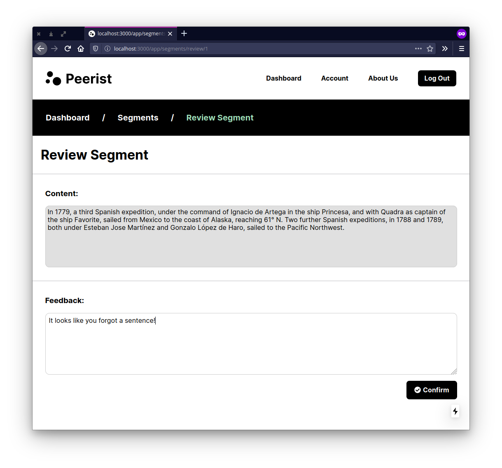
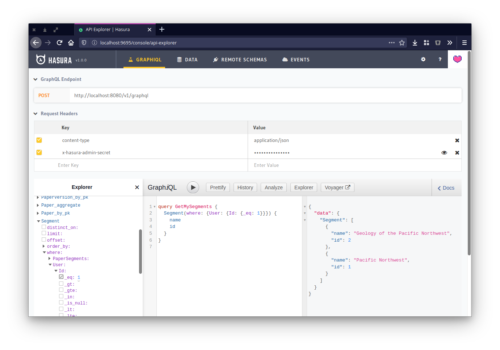

# Capstone

Peerist will be a web application that allows academic writers to receive feedback on their writing without worrying about plagiarism. Users start by subbmiting portions of text as **Segments**. Then, when ready, a user can put together their segments into **Papers**. These papers can be shared into **Circles**, which the user can create, invite users, and set as private or public. This is the general use order of this application.



**Segment**

A  limited  body  of  text  to  be  reviewed.  Segments  can  be  independently  versioned,  and  grouped  into  larger  works.




**Paper**

Papers are made of segments. Papers are independently versioned.


**Circles**

Circles  are  groups  of  users  that  share  a  specific  relationship.  These  could  be  members  of  a  university’s  department,members of a project team, or users that have otherwise selected each other. It is recommended that members in a circlehave at some point seen each other in person.

**Tools Used**

This web application uses the following tools:
- ReactJS
- NextJS
- Zeit Now
- Rebass CSS
- Auth0 for Authentication
- Hasura-GraphQL Engine as our database
- URQL React Component Hooks
- Docker & Docker Compose

Here is a look at how we tested our GraphQL queries before including them in the application.



## Setup and run

In order to start this web application, you will need a few tools. Most should be really easy to install. Some can be challening if you are running Windows 10 Home, particularly with docker.

Requirements
---
You should install these on your operating system. If you're running linux, you can probably just use your package manager to get all these.

>NOTE for Ubuntu users: Get NodeJS from here instead: https://github.com/nodesource/distributions/blob/master/README.md

- Docker - https://www.docker.com/get-started
- Docker Compose - https://docs.docker.com/compose/install/
- NodeJS with node package manager - https://nodejs.org/en/

Once you have those installed, its time to install the Postgres and Hasura-GraphQL engine images from docker hub. You can install these images by running the following commands in your terminal.
- `docker pull postgres` - https://hub.docker.com/_/postgres
- `docker pull hasura/graphql-engine` - https://hub.docker.com/r/hasura/graphql-engine

You should clone this respository and run `npm install`. 

Starting the project
---
In order to start the project aftering installing the requirements, follow these steps.

1. In the project directory, run `docker-compose up -d` to start the docker containers in detached mode.
2. Next, run `npx now@16.7.3 dev` to start Now, which will be what runs the web server on localhost. Watch the console. Sometimes the build will fail to compile on the first go. Press `ctrl + c` to stop, and run the command again.
3. Install the Hasura CLI, which you can do by running `npm i hasura-cli`.
4. Visit the web application on what is likely `localhost:3000`.

>NOTE: There is no dummy/test data included with this project! You will need to use the UI to create Segments, Papers and Circles. In order to invite other users into your Circle, they must have registered and logged into the site at least once. For the purposes of testing, you can use the Hasura Web Console (see below) to create users munually.

You can access most of the project from here, however if you want to use the Hasura GUI to modify the database schema or compose GraphQL, you can follow these steps.

1. In a new terminal, `cd hasura/` folder.
2. Start the hasura console by using `npx hasura console --admin-secret peeristcapstone`.
3. The Hasura Web Console should open in your web browser. You can use it to modify the schema or execute queries against the database.

Troubleshooting
--
These are some things that can occur when starting and using this project. Its not immediately clear why these problems occur, but at least there are work arounds.

**Installing Docker on Windows?**
>Docker requires Hyper-V enabled in Windows 10. Without this Docker will not run after you install Docker.

https://www.shaileshjha.com/step-by-step-how-to-install-docker-in-windows/

**Project fails to build**

This is identified as seeing the following output in the console after executing the `npx now@16.7.3 dev` command.

`> Error! Builder exited with 0 before sending build result`

The workaround for this is to just stop the server via `Ctrl + c` and running the server command again.

**Nothing happens after successfully logging in**

After completing a login through the external login service
(Auth0), you will be redirected to our web application. At this point you will notice that nothing happens, and the
app remains at a blank screen.

This seems to happen particularlly on Firefox, so a work around is to use Google Chrome. You can also use an incognitoo window in firefox and attempt the login again, and the app will load correctly.

**Docker Compose version not supported**

This can come up if you are running this project on a linux distribution and
your package manager installs 1.17.1. To fix this, modify the `docker-compose.yml` file, and change the `version` to something older, such as `version: 3.3` that is supported.

**The Hasura Console throws an error when trying to start**

Sometimes the Hasura GraphQL Engine Container is unable to acquire its needed port. Try `docker-compose down -v` to bring down the containers and clearing their volumes (which also deletes database data!) and then run `docker-compose up`. This will start you attached to the containers and you'll be able to see the output from Postgres and the Hasura GraphQL Engine. Hopefully this makes it more obvious what the problem is. If everything seems fine, detach from the container and start it with `docker-compose up -d` again. Then trying starting the Hasura Console this time, and hopefully it works!

## Addressing Feedback Received

This section is to comment on what this project has done in response to each of the feedback points provided by the reviewing teams. We are trying our best to meet their recommendations.


**Build**

>I was not able to get Hasura downloaded using 'npm install'...

>Had trouble running Docker on Windows 10...

We have added a step in the *Starting the Project* section of this document to account for the Hasura CLI. We also know that Windows proves challenging to install on. We hope to add some instructions to this document or at least links to resources to help windows users.

**Legibility**

>Code could be commented a bit more. There are large sections of code that look fairly complex and have no comments describing how they work.

>it’s very hard to understand what the code is doing...

We acknowledge that some of our files could use more comments. One of these files has improved comments (`pages/app/papers/review/[id].js`) and serves as a good role model for the rest of these files.

**Implementation**

>I think the code runs in a reasonable speed...

Being a browser application, there are some performance struggles. One of the places we could improve further is query optimization.

**Maintainability**

>probably add some test for bad input, etc....

>There are no unit tests. For a website, there probably should be...

Tests are an important part for any web application. However we have not created tests for this project as it was not critically important or stressed by our client. We would need a testing framework that could test the logic of our React components if we wanted to do this.

**Requirements**

>Still some things to work on and implement

>Database interaction needs to be integrated so that there's data persistence.

>No, the code only fulfill half of the requirements now but they said this is not the latest version.

At the time of the demonstration there were still parts of the project that had not been conected to the rest. As of now, this project has implemented all of the core requirements (Segments, Circles and Papers). Every page is backed with database interactions, so data persists accordingly. This app should also be (with minor tweaks of course) be deployable to a live platform such as Zeit Now (for the front-end) and DigitalOcean (say, for hosting the docker containers).

**Other**

>MOVE FROM LOCAL DEVELOPMENT TO HOSTED SITE.

>I think the code file can be more organize so people can find the specific file easier and definitely put some comments.

Our client has not provided (or stressed for that matter) deploying to a live-hosted site. If we wanted to do this, it would have to come at the expense (namely hosting fees) of the developers. In regards to organization, the file structure itself is meaningful as it defines the navigation of the site. However we hope to improve readability by adding more comments.

## About the Project Layout

>FYI this was provided by our client, however its a little out of date at this point. Please use the instructions above to start this project.

This repository consists of files for three major application components:

### Next

The frontend portion of the application. This component utilizes the following directories:

- `compononents`
- `pages`
- `public`
- `theme`
- `node_modules` (generated by NPM)
- `.next` (generated by Next and ignored from source control)

### Hasura

This is the GraphQL engine for the application, functionally the backend API layer. All of the files required by Hasura are in the `hasura` directory.

### Now Lambdas

These lambda functions are used by Hasura to do reactive data processing. These are located in the `api` directory, and they share `node_modules` with Next.

## Development

You need to launch the following services to develop this application:

- Docker Compose
- Hasura console
- `now dev`

First, from the root of the project, launch the Hasura GraphQL Engine and Postgres using Docker Compose:

```sh
docker-compose up
```

This will make Hasura available at `http://localhost:8080`. **NOT** the Hasura console, mind you. You'll use this endpoint to communicate with Hasura from the Next app using URQL.

Next, open another shell and launch the Hasura console:

```sh
# Install the console
npm i -g hasura-cli

# Navigate into the Hasura project directory
cd hasura

# Launch the console
hasura console --admin-key peeristcapstone
```

We launch the console using the Hasura CLI so that Hasura can save metadata to your local disk, which can then be saved into version control.

Finally, launch Next and the lambda functions for development:

```sh
# Install the Now CLI
npm i -g now

# Launch the development servers
now dev
```
